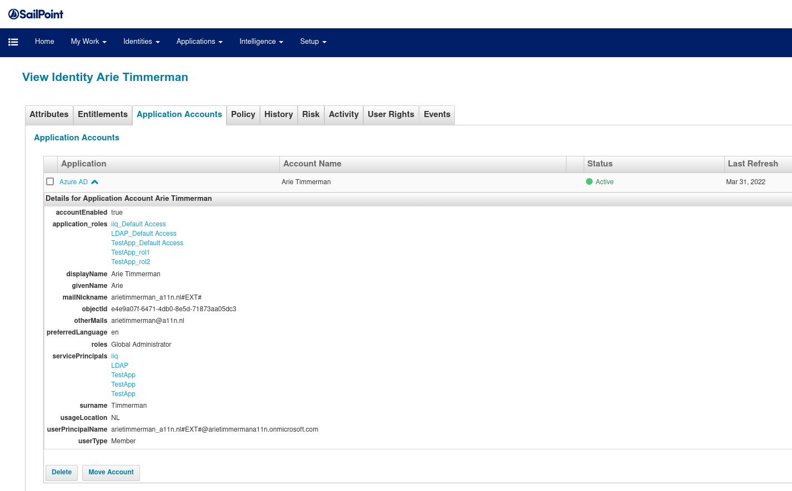

This is an improved Azure AD connector for SailPoint IdentityIQ that adds support for [application roles](https://docs.microsoft.com/en-us/azure/architecture/multitenant-identity/app-roles).

## Features

* Application role aggregation from all service principals
* Application role assignment aggregation
* Provisioning (add and remove application role assignments)

## Installation

Download SailPoint IdentityIQ from [https://community.sailpoint.com](https://community.sailpoint.com) and store the zip-file in `base/ga/identityiq.zip`.

~~~
gradle wrapper --gradle-version 6.8
./gradlew plugin_prepare_second
./gradlew build
~~~

Now move the file `build/libs/AzureADImproved-0.8.0.jar` to the IdentityIQ `WEB-INF/lib` folder.

Update your existing Azure AD application via the _debug interface_.

~~~.xml
<Application connector="nl.a11n.sailpoint.AzureADConnector" ...
~~~

Add the following entry.

~~~.xml
<entry key="connector-classpath">
    <value>
        <List>
        <String>/lib-connectors/connector-bundle-directories.jar</String>
        <String>/lib/AzureADImproved-0.8.0.jar</String>
        </List>
    </value>
</entry>
~~~

Add this to the account schema.

~~~.xml
<AttributeDefinition entitlement="true" managed="true" multi="true" name="application_roles" schemaObjectType="application_role" type="string">
    <Description>application_roles</Description>
</AttributeDefinition>
~~~

And add the schema for the `application_role` object.

~~~.xml
<Schema aggregationType="group" descriptionAttribute="" displayAttribute="displayableName" featuresString="PROVISIONING" identityAttribute="id" instanceAttribute="" nativeObjectType="application_role" objectType="application_role">
    <AttributeDefinition name="displayName" type="string">
        <Description>Display name of the channel</Description>
    </AttributeDefinition>
    <AttributeDefinition name="description" type="string">
        <Description>Decription of the channel</Description>
    </AttributeDefinition>
        <AttributeDefinition name="id" type="string">
    <Description>The channel's unique identifier</Description>
    </AttributeDefinition>
        <AttributeDefinition name="displayableName" type="string">
    <Description></Description>
    </AttributeDefinition>
</Schema>
~~~

## Support

Ask [Arie Timmerman](https://www.linkedin.com/in/arie/) from [a11n](https://www.a11n.nl)